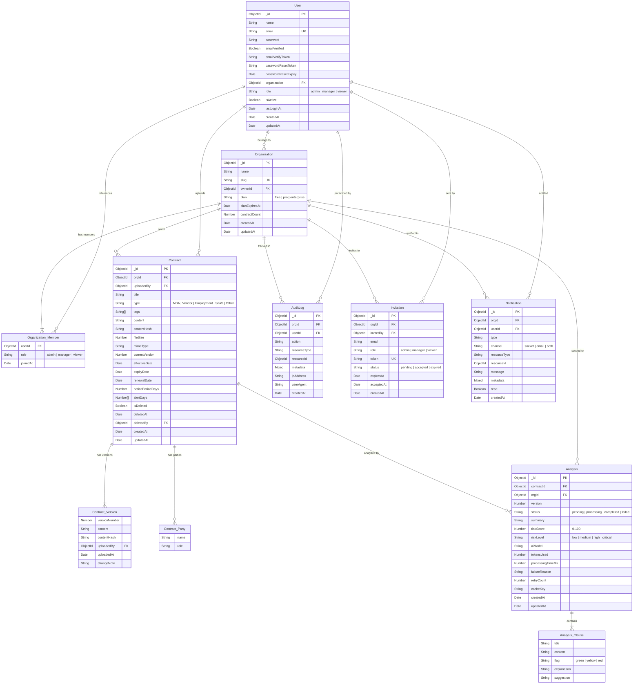
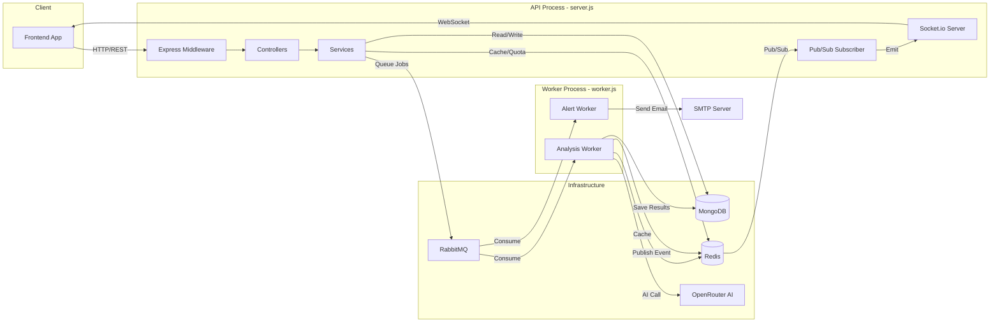

# LexAI — Full Project Guide

## What is LexAI?

LexAI is an **AI-powered legal contract intelligence** SaaS backend. Upload a contract (PDF, DOCX, or plain text), and LexAI will:

1. Extract the text from the document
2. Queue it for AI analysis via RabbitMQ
3. Use OpenRouter LLM to analyze risk, clauses, obligations, and key dates
4. Deliver results in real-time via WebSocket
5. Cache results in Redis for instant repeat lookups
6. Send expiry alerts via email and Socket.io

It's built as a multi-tenant system — every organization is isolated, with role-based access control (admin, manager, viewer) and per-user monthly analysis quotas.

---

## Folder Structure

```
LexAI/
├── server.js                  # API entry point — HTTP + Socket.io + cron
├── worker.js                  # Background worker — RabbitMQ consumers
├── package.json               # Dependencies, scripts, ESM config
├── .env                       # Environment variables (not committed)
│
├── scripts/
│   └── seed.js                # Creates first admin user on fresh DB
│
└── src/
    ├── app.js                 # Express setup — middleware, routes, error handler
    │
    ├── config/                # Infrastructure connections
    │   ├── env.js             # Zod-validated environment variables
    │   ├── db.js              # MongoDB connection with retry logic
    │   ├── redis.js           # Redis (command + subscriber) clients
    │   ├── rabbitmq.js        # RabbitMQ connection, channel, DLX/DLQ setup
    │   └── socket.js          # Socket.io with JWT auth + Redis adapter
    │
    ├── constants/             # Frozen configuration objects
    │   ├── httpStatus.js      # HTTP status code constants
    │   ├── plans.js           # Subscription tier limits (free/pro/enterprise)
    │   ├── queues.js          # RabbitMQ queue and Redis Pub/Sub channel names
    │   └── roles.js           # RBAC role constants
    │
    ├── models/                # Mongoose schemas (7 models)
    │   ├── User.model.js      # Users with bcrypt passwords, org ref, RBAC role
    │   ├── Organization.model.js # Multi-tenant container, embedded members array
    │   ├── Contract.model.js  # Contract text, versions, AI dates, alert config
    │   ├── Analysis.model.js  # AI analysis results per contract version
    │   ├── AuditLog.model.js  # Immutable action log with 90-day TTL
    │   ├── Invitation.model.js # Team invites with 48-hour TTL
    │   └── Notification.model.js # In-app notification feed
    │
    ├── services/              # Business logic layer (13 services)
    │   ├── auth.service.js    # Register, login, token rotation, password reset
    │   ├── user.service.js    # Profile CRUD, quota info
    │   ├── org.service.js     # Org CRUD, member management
    │   ├── contract.service.js # Contract CRUD, versioning, file text extraction
    │   ├── analysis.service.js # Analysis request, queue dispatch, cache check
    │   ├── ai.service.js      # OpenRouter API calls with model fallback chain
    │   ├── diff.service.js    # Version comparison via AI
    │   ├── alert.service.js   # Expiry scan, notification dispatch
    │   ├── audit.service.js   # Audit log writes and queries
    │   ├── email.service.js   # Nodemailer transporter, template methods
    │   ├── enrichment.service.js # REST Countries API for jurisdiction data
    │   ├── invitation.service.js # Invite create/accept workflow
    │   └── quota.service.js   # Redis-based monthly analysis count
    │
    ├── controllers/           # HTTP request handlers (7 controllers)
    │   ├── auth.controller.js
    │   ├── user.controller.js
    │   ├── org.controller.js
    │   ├── contract.controller.js
    │   ├── analysis.controller.js
    │   ├── admin.controller.js
    │   └── diff.controller.js
    │
    ├── middleware/             # Express middleware (7 files)
    │   ├── auth.middleware.js       # JWT verification + Redis blacklist
    │   ├── rbac.middleware.js       # Role-based access gate
    │   ├── validate.middleware.js   # Joi schema validation
    │   ├── quota.middleware.js      # Monthly analysis quota check
    │   ├── rateLimiter.middleware.js # IP-based Redis rate limiting
    │   ├── requestLogger.middleware.js # Request ID + Morgan → Winston
    │   └── errorHandler.middleware.js  # Global error handler (last middleware)
    │
    ├── validators/            # Joi schemas (4 files)
    │   ├── auth.validator.js
    │   ├── contract.validator.js
    │   ├── org.validator.js
    │   └── analysis.validator.js
    │
    ├── routes/                # Express routers (8 files)
    │   ├── index.js           # Route aggregator → /api/v1/*
    │   ├── auth.routes.js     # /api/v1/auth/*
    │   ├── user.routes.js     # /api/v1/users/*
    │   ├── org.routes.js      # /api/v1/orgs/*
    │   ├── contract.routes.js # /api/v1/contracts/*
    │   ├── analysis.routes.js # /api/v1/analyses/*
    │   ├── admin.routes.js    # /api/v1/admin/*
    │   └── health.routes.js   # /health
    │
    ├── utils/                 # Shared utilities (8 files)
    │   ├── AppError.js        # Custom error class with HTTP status codes
    │   ├── apiResponse.js     # Standardized success/error response helpers
    │   ├── asyncWrapper.js    # Catches async errors for Express 4
    │   ├── tokenHelper.js     # JWT sign/verify with JTI tracking
    │   ├── hashHelper.js      # SHA-256 hashing, UUID generation
    │   ├── textExtractor.js   # PDF, DOCX, and TXT text extraction
    │   ├── dateHelper.js      # Quota month keys, reset date calculation
    │   └── logger.js          # Winston logger (console + file transports)
    │
    ├── sockets/               # Real-time layer
    │   ├── events.js          # Socket event name constants
    │   └── pubsub.subscriber.js # Redis Pub/Sub → Socket.io bridge
    │
    ├── workers/               # RabbitMQ consumers
    │   ├── analysis.worker.js # AI analysis + diff job processing
    │   └── alert.worker.js    # Expiry notification dispatch
    │
    └── jobs/                  # Scheduled tasks
        └── expiry.cron.js     # Daily 2 AM UTC contract expiry scan
```

---

## How a Request Travels Through the System

### Example: User uploads a contract and requests AI analysis

```
Client → Express → Middleware Pipeline → Controller → Service → Database/Queue → Worker → Database → Redis Pub/Sub → Socket.io → Client
```

**Step-by-step:**

1. **Client sends POST** to `/api/v1/contracts` with a PDF file attached
2. **Express receives** the request and runs the middleware pipeline:
   - `attachRequestId` — assigns a UUID for tracing
   - `httpLogger` — logs method, URL, and response time via Winston
   - `rateLimiter` — checks IP-based rate limit in Redis
   - `authenticate` — verifies the JWT Bearer token, checks Redis blacklist
   - `multer` — parses the multipart form data and extracts the file buffer
3. **Controller** (`contract.controller.js`) extracts orgId and user info, passes to service
4. **Service** (`contract.service.js`):
   - Calls `textExtractor` to extract text from PDF/DOCX
   - Generates SHA-256 content hash for deduplication
   - Saves the contract to MongoDB with version 1
   - Logs the action via `audit.service.js`
5. **Response** returns the contract ID to the client

6. **Client sends POST** to `/api/v1/analyses` with the contractId
7. **Middleware pipeline** runs again (auth, quota check, validation)
8. **Service** (`analysis.service.js`):
   - Checks Redis cache by content hash — if cached, returns immediately
   - Creates an Analysis document with status "pending"
   - Publishes a job message to RabbitMQ analysis queue
   - Returns the analysis ID and estimated time

9. **Worker process** (`worker.js`) picks up the message:
   - Parses the job payload
   - Calls OpenRouter API via `ai.service.js` (with fallback model chain)
   - Updates Analysis document to "completed" with risk score, clauses, obligations
   - Caches the result in Redis (24-hour TTL)
   - Publishes a Socket.io event via Redis Pub/Sub

10. **API server** receives the Redis Pub/Sub message via `pubsub.subscriber.js`
11. **Socket.io** emits `analysis:complete` to the org's room
12. **Client** receives the real-time notification and fetches the full result

---

## ER Diagram



---

## Data Flow Architecture



---

## Security Architecture

| Layer | Mechanism |
|---|---|
| **Authentication** | JWT access tokens (15min) + HttpOnly refresh cookie (7d) |
| **Token Revocation** | Redis blacklist — logged-out tokens are rejected |
| **Token Rotation** | Every refresh generates a new pair of tokens |
| **Authorization** | RBAC middleware — admin, manager, viewer roles |
| **Input Validation** | Joi schemas on every mutating endpoint |
| **NoSQL Injection** | `express-mongo-sanitize` strips `$` and `.` from input |
| **Rate Limiting** | IP-based Redis sliding window (100 req/min default) |
| **Security Headers** | Helmet.js sets CSP, HSTS, X-Frame-Options, etc. |
| **Password Hashing** | bcrypt with 12 salt rounds |
| **Email Enumeration** | Forgot-password always returns generic success message |
| **CORS** | Whitelist-based, configurable via environment variable |
| **File Upload** | MIME type filter + 5MB size limit via multer |

---

## Subscription Plans

| Feature | Free | Pro | Enterprise |
|---|---|---|---|
| Analyses per month | 3 | 50 | Unlimited |
| Contracts | 10 | 500 | Unlimited |
| Members | 3 | 25 | Unlimited |
| Version comparison | ❌ | ✅ | ✅ |
| Priority queue | ❌ | ❌ | ✅ |
